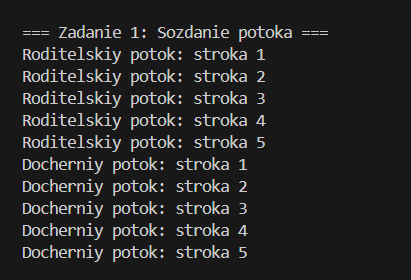
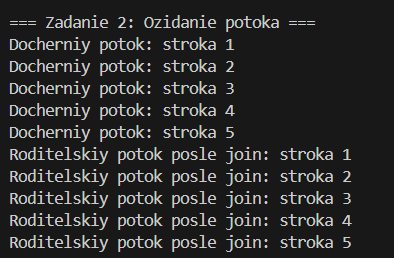
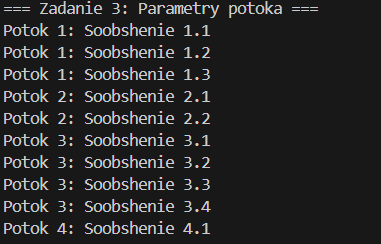
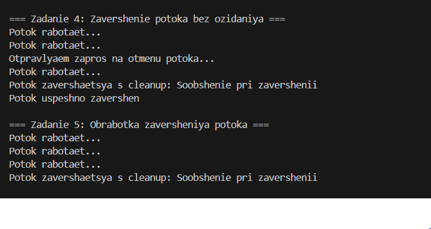
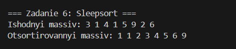
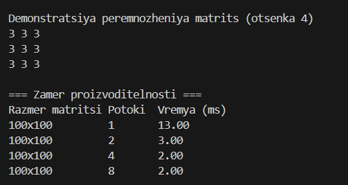
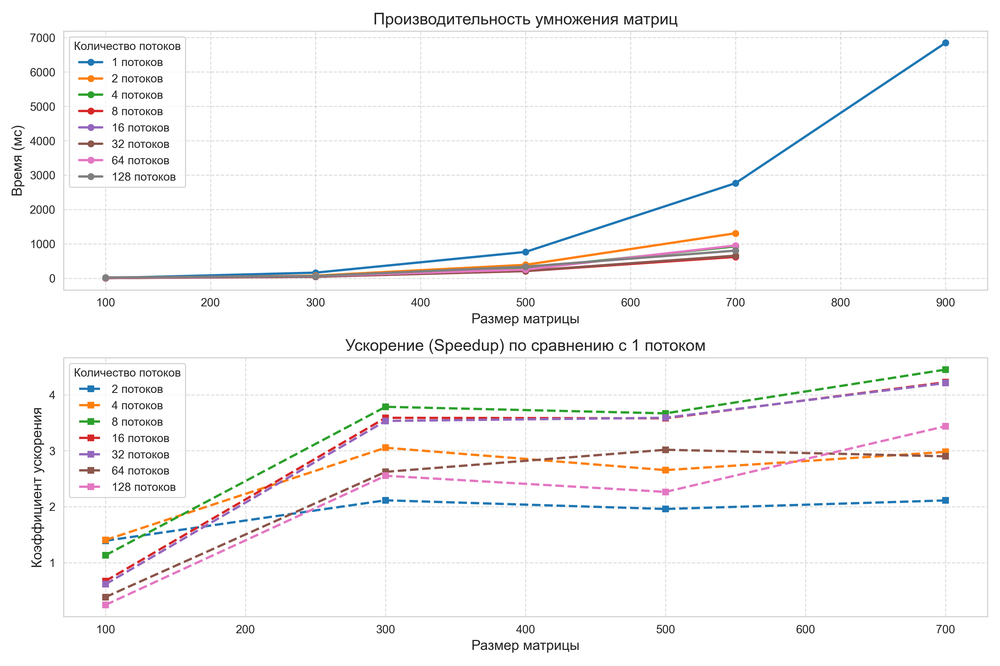
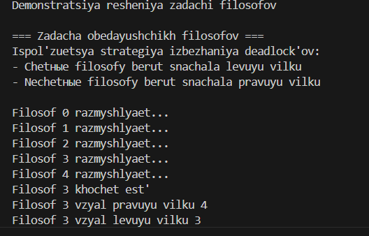

# Лабораторная работа №7: Многопоточное программирование

**Цель работы:**  
Изучение базовых механизмов многопоточного программирования на языке C с использованием библиотеки `pthread`.

---

## 1. Задание1

## 2.

## 3.

## 4,5

## 6

## 7

## 8

